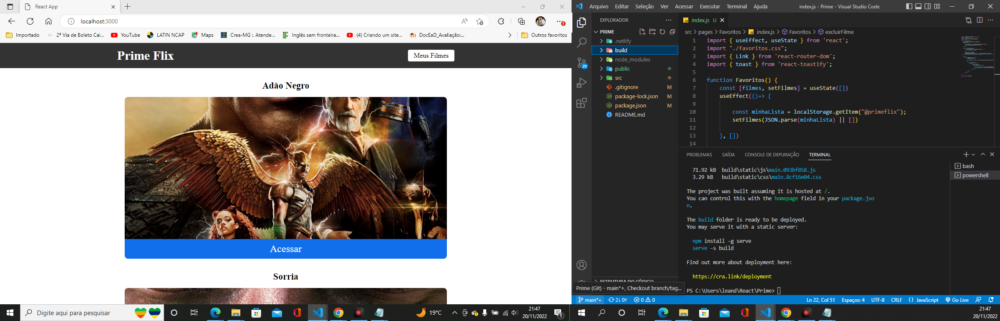

  <a href="#-projeto">Projeto</a>&nbsp;&nbsp;&nbsp;|&nbsp;&nbsp;&nbsp;
  <a href="#-tecnologias">Tecnologias</a>&nbsp;&nbsp;&nbsp;|&nbsp;&nbsp;&nbsp;
  <a href="#-instalação">Instalação</a>&nbsp;&nbsp;&nbsp;|&nbsp;&nbsp;&nbsp;
  <a href="#-layout">Layout</a>&nbsp;&nbsp;&nbsp;|&nbsp;&nbsp;&nbsp;

 

  

# 💻 Projeto:

Prime Flix é um projeto estilo filmaria, o projeto utiliza uma API para listar mais de dez filmes de lançamentos atuais para o usuário e abaixo segue a imagem do projeto em React.
  

## 🚀 Tecnologias:
* React
* Axios
* React-router-dom

## 🔖 Instalação

* Baixar o NPM e o Node

* Abrir o projeto em uma IDE de preferência ou no terminal do sistema operacional

  * `npm install`

  * `npm start`

  
* Caso a aplicação rode normalmente, estará disponível em `localhost:3000`

## 🔖 Layout

Você pode visualizar o layout do projeto através [desse link](https://marvelous-hotteok-4c6c89.netlify.app/)

## Utilitários 
Link API utilizado:

Link do The movie DB utilizado no projeto, para ser adicionado os lançamentos de filmes da sua preferência no projeto.

https://www.themoviedb.org/settings/api

